# teacher

An educational application that allows the teacher to provide educational content and courses, while setting tests for students, while allowing students to view teachers’ files and educational content, choose to reserve course content, and be able to attend the test online. 

## packages
  state management (cubit)
  dependencies (get_it)
  localization
  clean architecture
  firebase

## Screens
  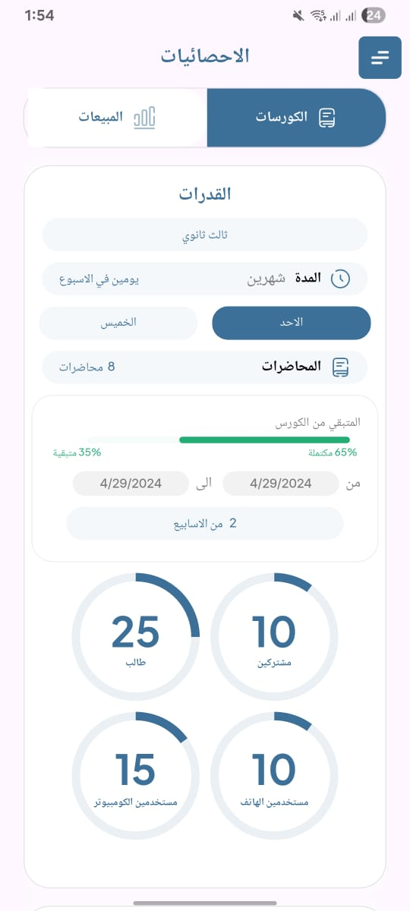
  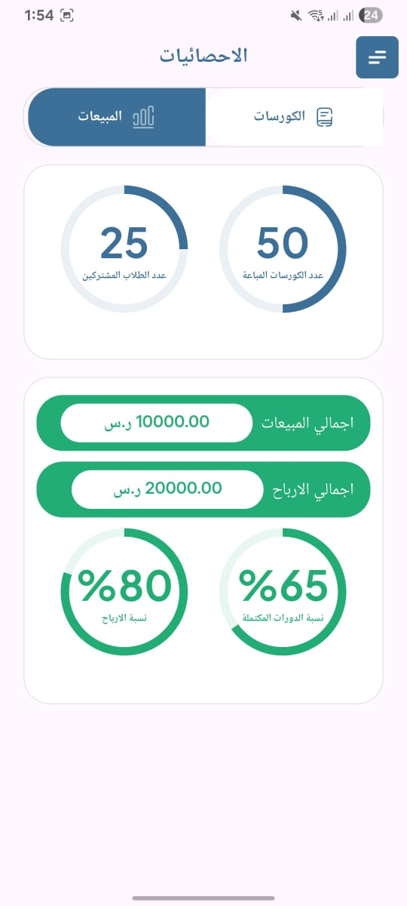
  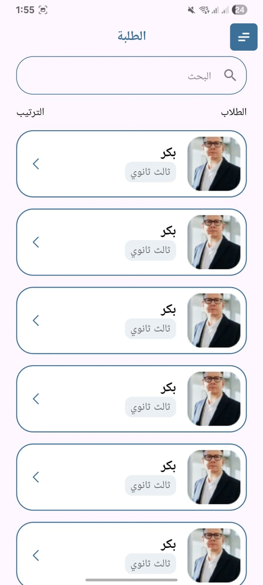
  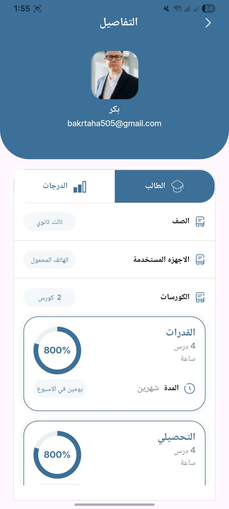
  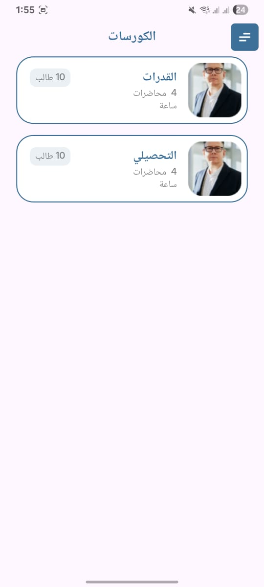
  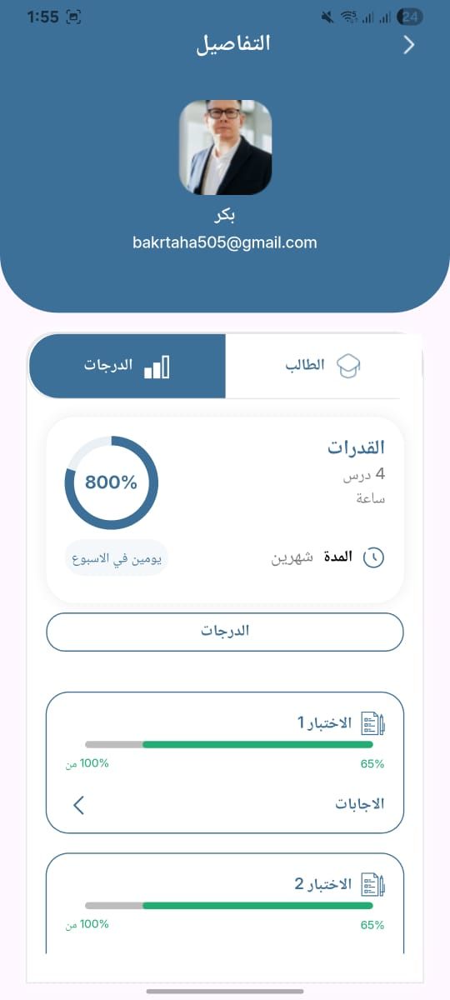
  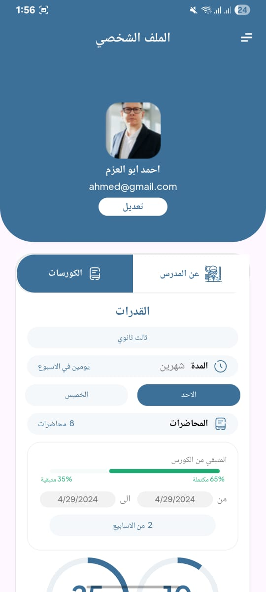
  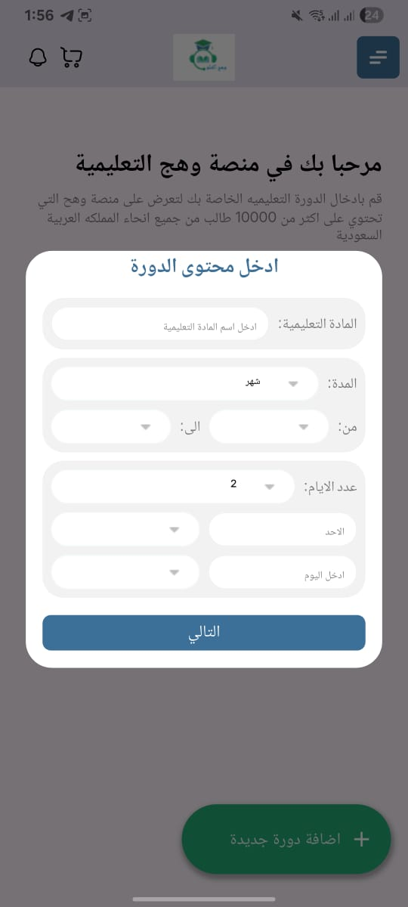
  
  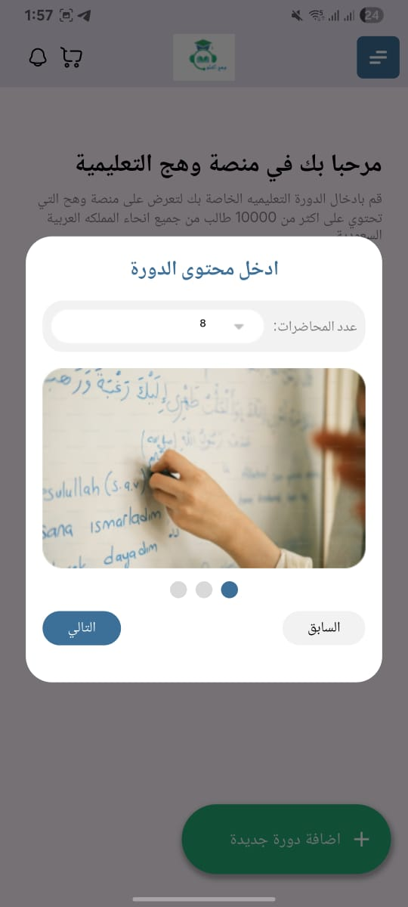
  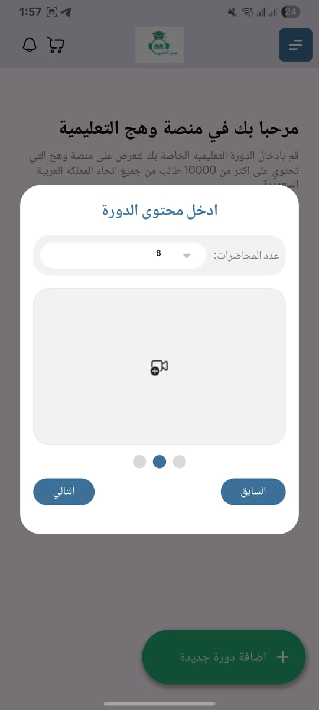
  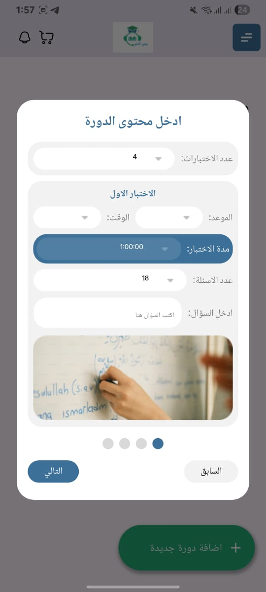
  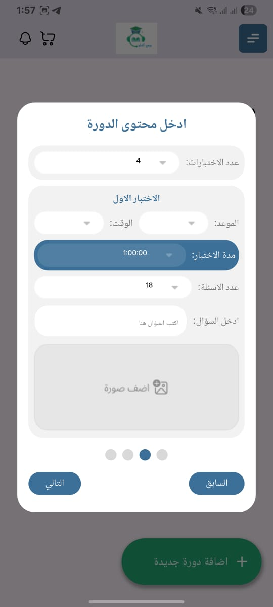
  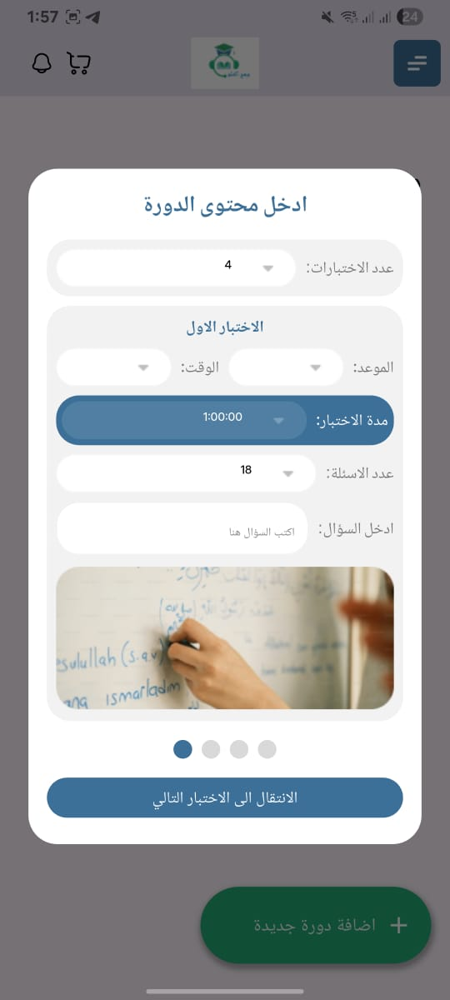